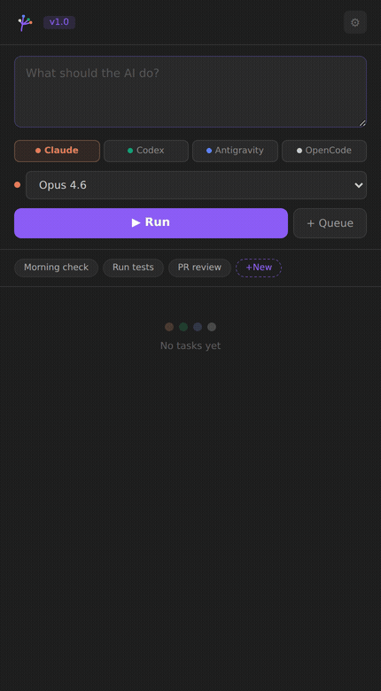
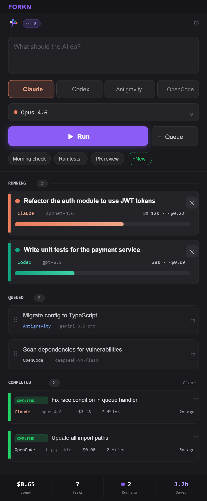
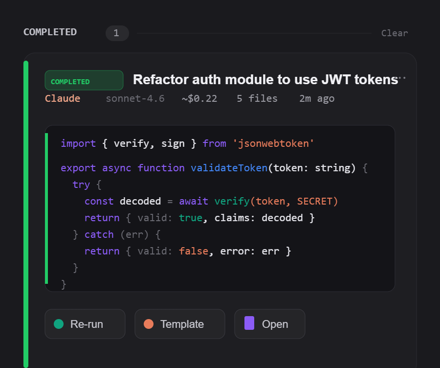

# Forkn

> One sidebar. Every AI agent. All at once.

Forkn lets you run multiple AI coding agents in parallel from a single VS Code sidebar. Queue tasks across Claude Code, Codex CLI, Antigravity CLI, and OpenCode — all running simultaneously.

## Features

- **Parallel execution** — Queue multiple AI tasks and run them simultaneously
- **4 providers** — Claude Code, Codex CLI, Antigravity CLI, OpenCode
- **Model selection** — Pick the exact model per provider (Sonnet, Opus, o4-mini, etc.)
- **Live output** — Streaming terminal output from each task inline
- **Auto-detection** — Forkn detects which CLIs you have installed and enables them automatically
- **Re-run** — Re-run any completed task with one click
- **Templates** — Quick-launch common workflows (morning check, run tests, PR review)

## Usage

1. Open the Forkn sidebar (fork icon in the activity bar)
2. Type a task description
3. Click a provider tab (Claude, Codex, Antigravity, or OpenCode)
4. Pick a model from the dropdown
5. Hit **▶ Run** (or `Ctrl+Enter`)
6. Queue more tasks — they run in parallel

## Prerequisites

Install at least one AI CLI tool:

- **Claude Code**: `npm install -g @anthropic-ai/claude-code`
- **Codex CLI**: `npm install -g @openai/codex`
- **Antigravity CLI**: See Google's installation guide
- **OpenCode**: `npm install -g opencode`

Forkn wraps these CLIs — no API keys needed in Forkn itself.

## Configuration

| Setting | Default | Description |
|---------|---------|-------------|
| `forkn.maxParallelTasks` | `3` | Max concurrent tasks |
| `forkn.providers.claudeCode.path` | `claude` | Path to Claude Code binary |
| `forkn.providers.codex.path` | `codex` | Path to Codex CLI binary |
| `forkn.providers.antigravity.path` | `agy` | Path to Antigravity CLI binary |
| `forkn.providers.opencode.path` | `opencode` | Path to OpenCode binary |

## Privacy

Forkn runs locally. It spawns the AI CLI tools you already have installed and displays their output. Your prompts and code go only to the AI provider you chose — never to Forkn's servers, because Forkn has none.

**Telemetry (opt-in, off by default).** On first run, Forkn asks whether you'd like to share anonymous usage data to help improve it. If you decline (or never answer), nothing is ever sent. If you allow it, Forkn sends:

- Task events: provider, model, prompt *length* (a number — never the text), duration, output size, success/failure
- Error events: provider, model, error type, and an error message with all file paths stripped
- Feature usage: event names like `template_created` or `task_queued`
- Startup: operating system, RAM size, CPU core count

What is **never** collected: prompt text, code, file contents, file names, keystrokes, or anything personally identifying. The anonymous ID is VS Code's built-in machine identifier.

**Sharing prompts in error reports (separate opt-in, off by default).** If you additionally enable `forkn.telemetry.sharePromptsInErrorReports`, the prompt text and task output are attached to *failed*-task reports only — never successful ones — to help debug provider failures. Leave it off and no prompt or code content is ever collected.

**Opting out.** Set `forkn.telemetry.enabled` to `false` at any time, or disable VS Code's global telemetry (`telemetry.telemetryLevel`) — Forkn respects both.

## License

MIT
